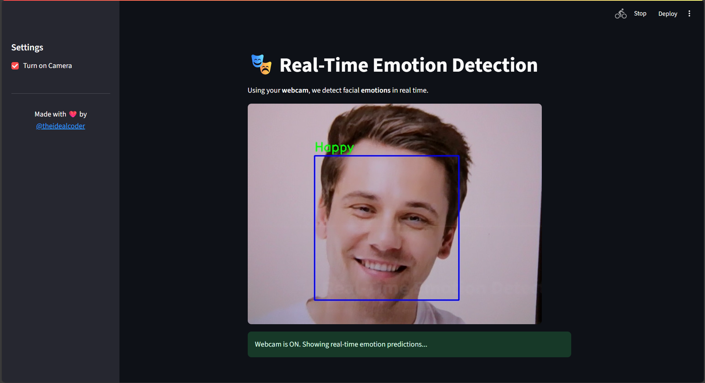
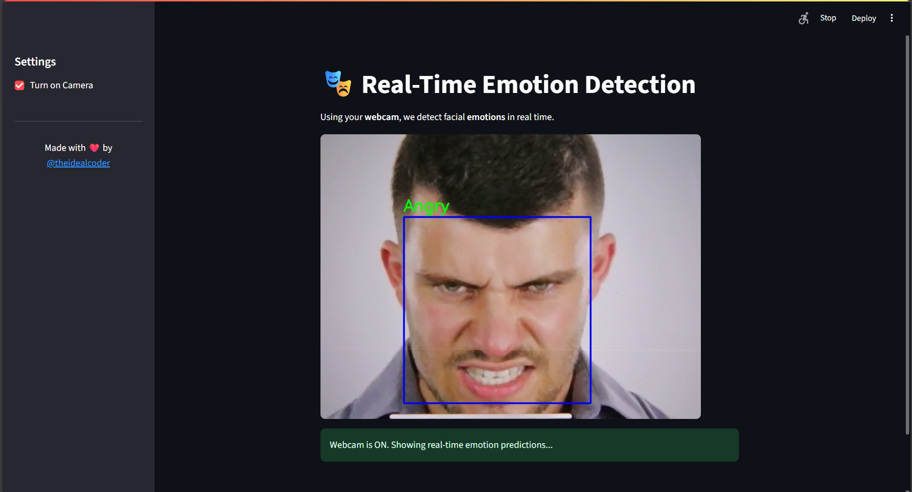

# 📸 Real-Time Emotion Detection App

Detect human emotions in real-time using deep learning and your webcam, built with **TensorFlow**, **OpenCV**, and **Streamlit**.


## 🚀 Features

- 🔍 Real-time emotion recognition from webcam feed  
- 🧠 Trained on **FER-2013** dataset with high accuracy  
- 💻 Simple and interactive **Streamlit UI**  
- 💬 Detects emotions like: **Happy**, **Sad**, **Angry**, **Fear**, **Surprise**, **Neutral**.  
- 💡 Easy to run locally or deploy on the web  


## 🎭 Emotions Detected
| Label    | Emoji | Description        |
| -------- | :---: | ------------------ |
| Angry    |   😠  | Displeasure, upset |
| Happy    |   😄  | Smiling, cheerful  |
| Sad      |   😢  | Crying, downcast   |
| Fear     |   😨  | Shock, scared      |
| Surprise |   😲  | Amazed, startled   |
| Neutral  |   😐  | No emotion         |

## 📷 Screen Shots



## 🧠 Tech Stack
Python 3.10, 
TensorFlow / Keras,
OpenCV,
Streamlit,
FER-2013 Dataset


## 🙋‍♂️ Author

Connect on [Instagram](https://instagram.com/theidealcoder)  
Follow on [GitHub](https://github.com/parth-udawant)
<p align="center">Made with ❤️ by <a href="https://www.instagram.com/theidealcoder">@theidealcoder</a></p>

## 📦 Installation

```bash
# 1. Clone the repo
git clone https://github.com/parth-udawant/emotion-detection.git
cd emotion-detection

# 2. Create and activate virtual environment (optional but recommended)
python -m venv venv
# Activate venv:
# On Windows:
venv\Scripts\activate
# On Mac/Linux:
source venv/bin/activate

# 3. Install dependencies
pip install -r requirements.txt

# 4. Run the app
streamlit run app.py

